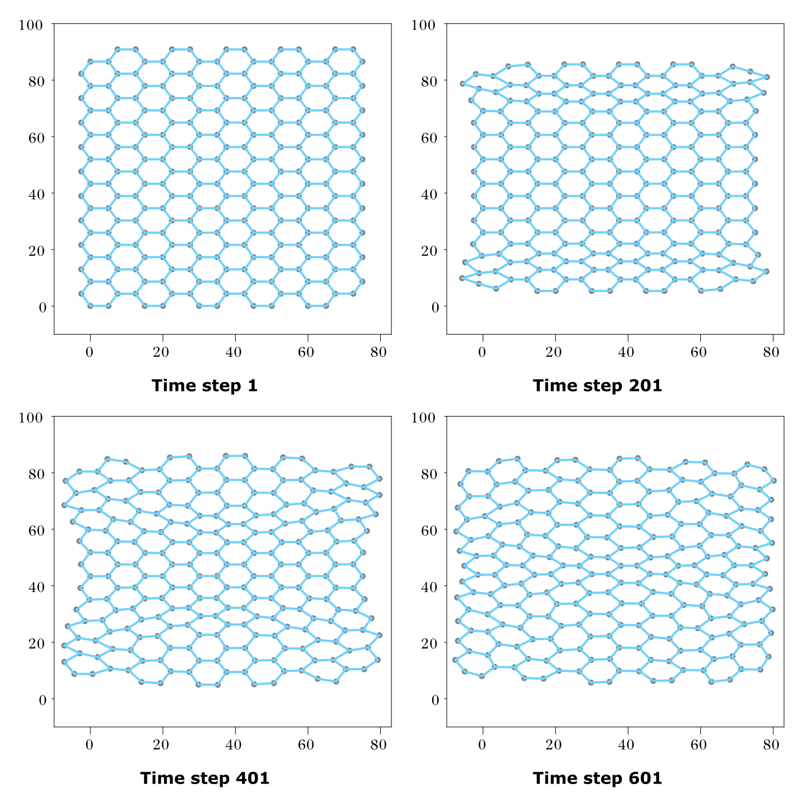
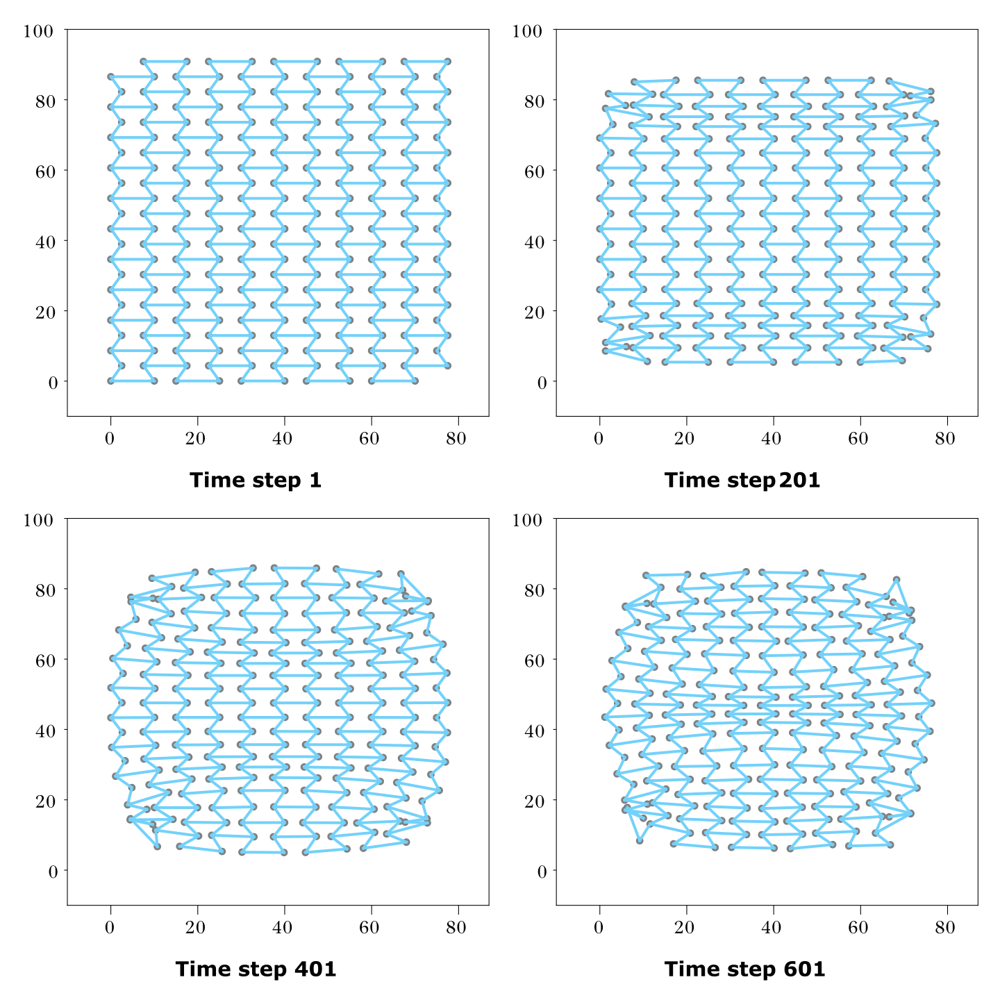
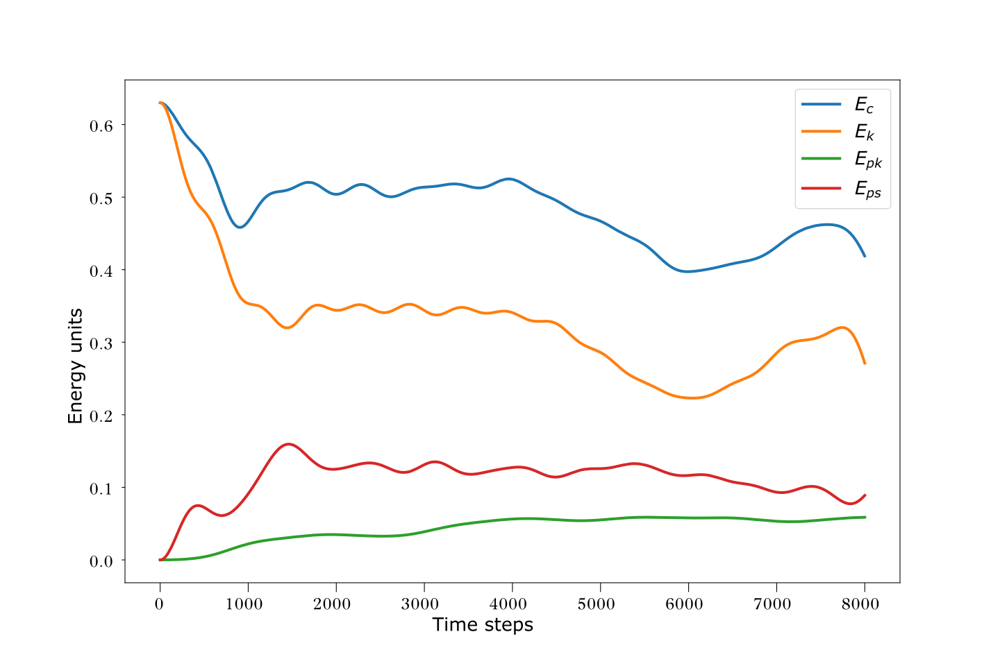

# Spring Lattice Simulations

A physcial simulation of differnet lattice structures of mass points connected by springs.


## Features

- Honeycomb-like lattice structure generation
- Support for both Euler and Verlet numerical integration methods
- Spring potential and angular potential used
- Visualization of lattice evolution

## Description

### Lattice Generation

The program simulates the movement of lattice points for given:
- Initial point positions
- Masses of points
- Connections between points
- Spring constants of connections
- Lengths of springs when no forces act on them

The lattice generator (`lattice_generator.py`) creates:
- Mass point coordinates
- Connections between points
- Lengths of springs when no forces act on them

The generated lattice consists of hexagonal "cells" resembling a honeycomb structure. To generate the lattice, you specify:
- Number of cells vertically and horizontally
- Lengths of two adjacent cell sides
- Angle between these sides

### Physical Model

The simulation treats connections between mass points as harmonic oscillators with two types of potentials:

1. Spring Potential:
```math
V_S = -\frac{1}{2}k(l-l_0)^2
```
where:
- k is the spring constant
- l is the distance between mass points
- l₀ is the natural spring length

2. Angular Potential:
```math
V_A = \frac{1}{2}k(\theta-\theta_0)^2
```
where:
- k is the proportionality constant
- θ is the angle between connections sharing a mass point
- θ₀ is the initial angle

The force acting on each point is calculated using:
```math
\vec{F}=-\nabla V
```

### Numerical Methods

The simulation implements two numerical methods for calculating mass point positions:

1. **Euler Method**
```math
\vec{r}_\text{next}=\vec{r} + \vec{v}\Delta t
```
```math
\vec{v}_\text{next}=\vec{v} + \vec{a}\Delta t
```
This method is less accurate, with error accumulating at each step.

2. **Verlet Method**
```math
\vec{r}_\text{next}=\vec{r} + \vec{v}\Delta t + \frac{1}{2}\vec{a}\Delta t^2
```
```math
\vec{v}_\text{next}=\vec{v} + \frac{1}{2}(\vec{a} + \vec{a}_\text{next})\Delta t
```
More accurate as it:
- Includes acceleration contribution in position updates
- Uses averaged acceleration from two consecutive steps for velocity updates

## Example

As an example unique mechanical properties of auxetic (negative Poisson's ratio) materials under compression are presented. Behaviour of both auxetic and non-auxetic lattices is shown, demonstrating their different responses to compression forces.

### Non-auxetic Lattice Compression

*Figure 1: Simulation of non-auxetic lattice under compression, showing lateral expansion*

### Auxetic Lattice Compression

*Figure 2: Simulation of auxetic lattice under compression, showing lateral contraction*

### Energy Conservation

*Figure 3: Energy conservation plot showing:*
- Total energy (Ec)
- Kinetic energy (Ek)
- Angular potential energy (Epk)
- Spring potential energy (Eps)

Note: The total energy is not perfectly conserved due to the limitations of the Verlet method (second-order accuracy). For more precise physics simulations, a fourth-order method like Runge-Kutta could be used.

## Project Structure

- `lattice_simulation.ipynb` - Simulation notebook
- `lattice_generator.py` - Lattice structure generation utilities
- `numerical.py` - Numerical methods implementation
- `physics.py` - Main part of the project with all physics implemented
- `visual.py` - Script creating visualisation of the evelution of the system

## Usage

1. Generate simulation data:
```bash
jupyter notebook lattice_simulation.ipynb
```

2. Run visualization:
```bash
python visual.py
```
